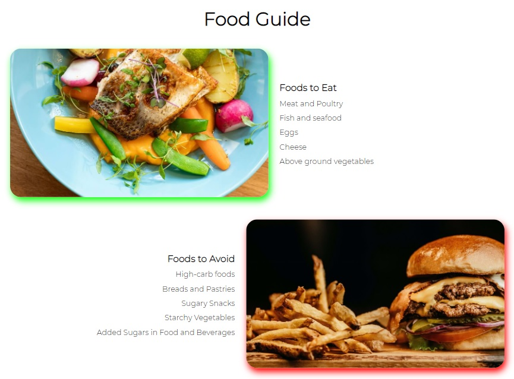

# Keto Bubble

Keto Bubble is a website that provides information for people who are interested in starting a keto diet. It offers simple, straightforward yet very helpful information for those who are thinking of trying a ketogenic diet.

The users of the website are provided with information about the Keto Bubble organization, basic facts about keto diet and contact information. This website is created for people who are new to the ketogenic diet community.

## Features ##

- ### Navigation ###
    - The navigation bar is located at the very top of the website. It is simple yet an effective feature of the website.
    - The navigation includes three links to different sections and these are accessible in each page.
    - This feature provides easy navigation for users from page to page across different devices.

 

- ### The Header and Landing Page Image ###
    - The header of the page features the name of the organization.
    - This section is displayed in big font and is separated from the navigation bar to highlight the importance of the name of the organization.    
    - The header also features an image that attracts users to know more about keto facts.

 

- ### Keto Facts Section ###
    - The keto facts section features basic information about ketogenic diet.
    - Users are provided with fundamental facts of keto which includes definition, types and its benefits.
    - This section features eye-catching images that make the site vibrant and rich.

 

- ### Food Guide Section ###
    - This section presents an uncomplicated guide to users showing the kinds of food to eat and which ones to stay away from.
    - This feature also displays two images that relates to the food guide to make this section remarkable.

 

- ### Footer / Social Media Section ###
    - The social media section contains three icons that links to three of the most commonly used social media apps. Each of these links, when clicked, will lead the users to another tab to retain the main page when browsing.
    - This feature is essential to users as this will give them access to more information that is available in the social network of the organization.
 

 

- ### About Section ###
    - The about section features a short description of the organization.
    - This section reveals the commitment and the mission of the organization.
    - This page also exhibits an image that depicts the culture and vibe in the organization.

 

- ### Contact Page ###
    - This page features a large image with a friendly question that invites users to fill out the form and contact the organization.
    - This section features a simple style, short and an uncomplicated form for a quick message or query from the users of the website.
    - The contact form collects four essential information from the users: full name, email address, phone number and message. 
 

 

- ### Features Left to Implement ###
    - Other features or stylings to be implemented  

 

## Testing ##

- I have tested this page in three different browsers including Chrome, Firefox and Microsoft Edge.
- I confirmed that the project is responsive and functions in various screen sizes using the devtools device toolbar.
- I confirmed that the features of the website including the navigation bar, heading, contents and other sections are completely clear and easy to understand.
- I have confirmed that the contact form works and that each input field will only accept the required details from the users and that the send message button works correctly.

 

### Bugs ###
- No bugs identified.

### Validator Testing ###
- HTML - No errors were returned when passing through the official [**W3C validator**](https://validator.w3.org/#validate_by_input+with_options)
- CSS - No errors were found when passing through the official [**(Jigsaw) validator**](https://jigsaw.w3.org/css-validator/#validate_by_input)

### Unfixed Bugs ###
- No unfixed bugs

 

## Deployment ##
- The site was deployed to GitHub pages
- The site was deployed to GitHub pages. The steps to deploy are as follows:
    - In the GitHub repository, navigate to the Settings tab.
    - From the source section drop-down menu, select the main Branch.
    - Once the main branch has been selected, the page provided a link the completed website. 
The live link can be found here - ############

 

## Credits ##

### Content ###
- Some codes were inspired by the Love Running Project.

### Media ###

- The images included in the website were taken from [Pexels.com](https://www.pexels.com/). The links are provided below:
(https://www.pexels.com/photo/hamburger-and-fries-photo-2983101/)
 
(https://www.pexels.com/photo/salmon-dish-with-vegetables-1516415/)
 
(https://www.pexels.com/photo/man-pouring-drink-on-woman-s-glass-3184181/)
 
(https://www.pexels.com/photo/assorted-vegetable-lot-1300972/)
 
(https://www.pexels.com/photo/woman-slicing-gourd-1153369/)
 
(https://www.pexels.com/photo/photo-of-vegetables-and-fruit-on-table-4117543/)
 
(https://www.pexels.com/photo/photo-of-vegetable-salad-in-bowls-1640770/)
 
(https://www.pexels.com/photo/white-and-black-number-3-5242266/)
 
(https://www.pexels.com/photo/photo-of-sliced-cheese-on-wooden-surface-4087609/)

    

